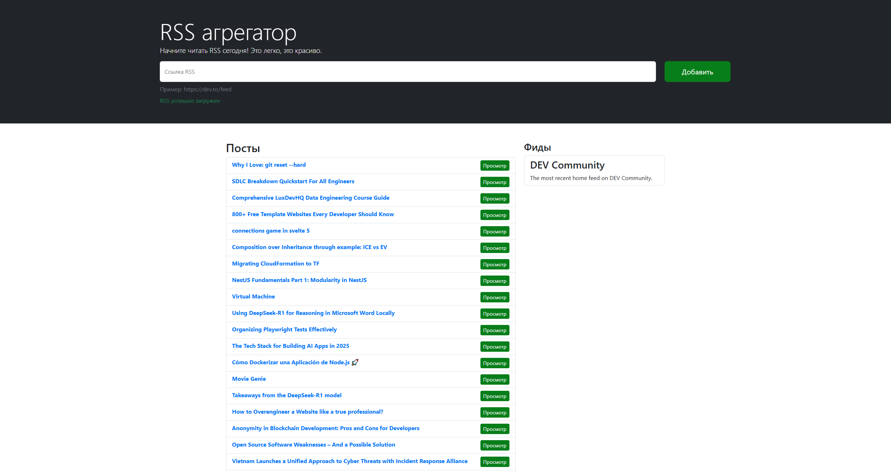

### Hexlet tests and linter status:

# RSS Reader
[RSS Reader](https://frontend-project-11-self-five.vercel.app/) — сервис для агрегации RSS-потоков, с помощью которых удобно читать разнообразные источники, например, блоги. Он позволяет добавлять неограниченное количество RSS-лент, сам их обновляет и добавляет новые записи в общий поток.

В сервис втроена проверка на правильность ввода данных и отлавливаются следующие ошибки:
    - Ошибка сети
    - Ресурс не содержит валидный RSS
    - Неизвестная ошибка
    - Ссылка должна быть валидным URL
    - Поле не должно быть пустым
    - RSS уже существует

При валидности RSS ссылки, данные парсируются и выводятся на экран. Сервис позволяет добавлять RSS записи, 
просматривать их, а также переходить по ссылке источника.

# Example
