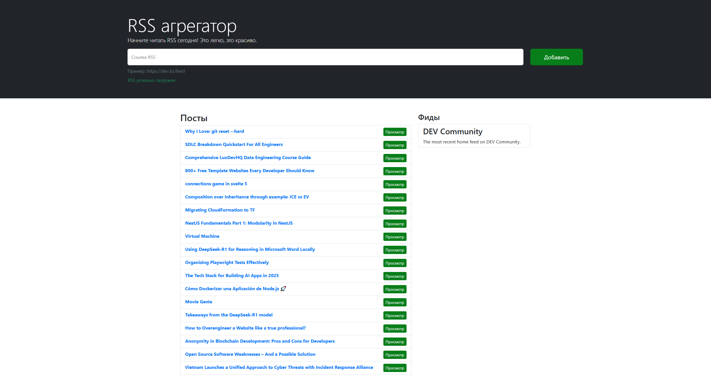

### Hexlet tests and linter status:

# RSS Reader
[Rss Reader](https://frontend-project-11-self-five.vercel.app/) — сервис для агрегации RSS-потоков, с помощью которых удобно читать разнообразные источники, например, блоги. Он позволяет добавлять неограниченное количество RSS-лент, сам их обновляет и добавляет новые записи в общий поток.

    

